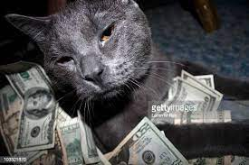

# Robert's User Page!
## Welcome to my Github page
### Hopefully you will learn some things about me here!

## Table of Some Contents
[About Me](#about-me)

[Languages I Know](#programming-languages-that-i-know)

[Rating Languages](#rating-programming-languages)

[Tasks](#tasks)

[Future Me?](#future-me)

Here is a picture of a cat that I think looks cute :^)

### About Me
I am a third year **Math-CS** major. I have already had *one internship* and I will be having another one this summer.
I was ~~19~~ 20 when I wrote my first line of code, that is because I was initially a history major before I switched into 
**Math-CS**. One pun I like is: 

>Time flies like an arrow, fruit flies like a banana.

My first line of code was in Java and it was `system.out.println("hello world");`
A video that I feel best represents me is found [here](https://tinyurl.com/yux39ajn).

### Programming Languages that I know!
Some programming languages I have experience with are:
- Java
- C++
- C
- Javascript
- Python

[secret_cat](/secret_cat.jpeg)

### Rating Programming Languages
I'd probably rate them from my favorite to least favorite:
1. C++
2. Python
3. Javascript
4. Java
5. C

### Tasks
Some tasks I would like to complete are:
- [x] Enroll in CSE 110 with Powell
- [ ] learn more about software engineering
- [ ] get practical experience
- [ ] profit?

### Future Me?
Me after getting a job in industry:

